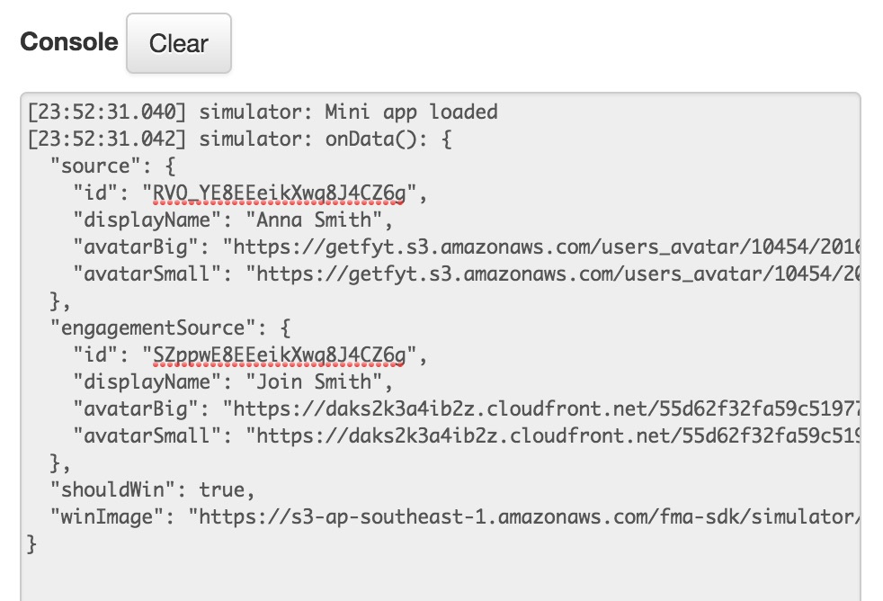

Web-based Simulator
====================

The web-based simulator is a web app designed to simulate how your mini app will appear on the device as well as let you test 
if your your integration with the AQ Core Library and the lifecyle is working as it should. You can access the simulator at 
`http://fma-sdk.s3-website-ap-southeast-1.amazonaws.com/simulator/index.html <http://fma-sdk.s3-website-ap-southeast-1.amazonaws.com/simulator/index.html>`_.

.. image:: /images/simulator.jpg

Opening the Simulator
----------------------

To use the simulator, you should provide the URL of your mini app. ``file:///`` URLs will not work in case you are developing in your local machine.
In such cases, you should run a local web server to host your files. One such web server that you can use is `Serve <https://www.npmjs.com/package/serve>`_.
To install Serve, run the following in your terminal

.. code-block:: bash

  $ npm install -g serve

Then execute it, pointing at your source files, preferably running it at port 3000.

.. code-block:: bash

  $ serve -p 3000 path/to/your/source

Parts of the Simulator
----------------------

The simulator has the following parts:

#. **Phone Screen** - This portion simulates a mobile device (in this case, an iPhone) where your mini app will be displayed. Bear in mind that when
   you develop your mini app, it should be resolution-independent.

#. **Options Panel** - This is where you input information that the simulator will utilize during your session:

   * **Mini App URL** - This is where you specify the URL of your mini app. It defaults to ``http://localhost:3000``.
   * **Mini App Data** - This is where you specify input data that will be passed to your mini app when the simulator raises an ``onData`` event.
     (see :ref:`core_concepts_events`)
   * **Console** - Events generated by the simulator as well as methods called by your mini app are logged here.

Using the Simulator
---------------------

Open the `simulator <http://fma-sdk.s3-website-ap-southeast-1.amazonaws.com/simulator/index.html>`_ in your browser (preferably in Safari to check 
how your your mini app will behave and render in iOS, and the same for Chrome to check for Android). Input your mini app URL in the *Mini App URL* text box 
and click the **Go** button. Your mini app should appear inside the simulated phone screen.

Once your mini app has been loaded, the console will print out information about events generated by the simulator. These events are outlined in detail
in the :ref:`core_concepts_events` portion of the Integration Guide. Initially, the console will inform you that your mini app has been loaded and 
that it has raised the ``onData`` event.

  
  Simulator console showing initial generated events.

Clicking on **Go** will reload your mini app. The **Reset** button will fire the ``onReset`` event to instruct your mini app to reset to an initial state.

.. note::

  Clicking the **Reset** button will not automatically reset your mini app. You have to setup the proper callbacks to handle the ``onReset`` event.
  See :ref:`core_concepts_callbacks` for more info.

Every time you either reload or reset your mini app, it will take the current **Mini App Data** and pass it as a parameter to ``onData`` and ``onReset`` events, 
respectively.